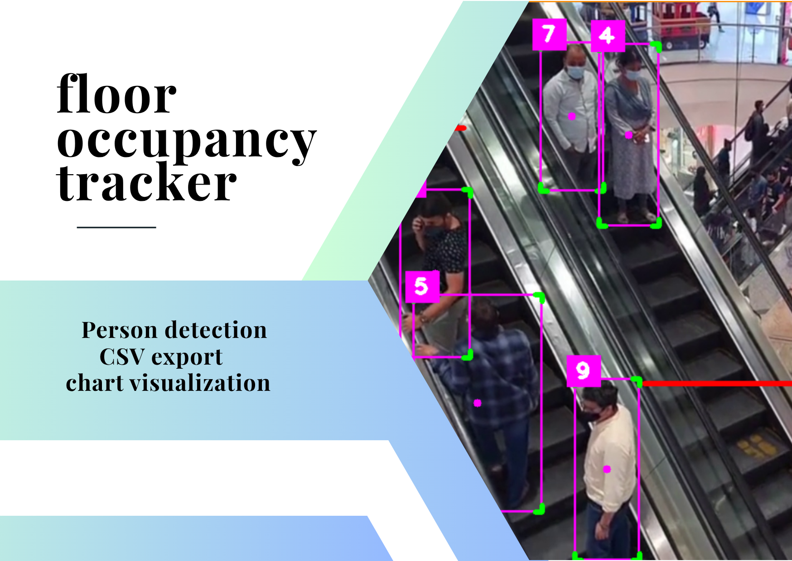

# Floor Occupancy Tracker 🚶‍♂️📈

A computer vision system using YOLOv8 and SORT tracking to count people entering and exiting a floor in real-time. It logs the net occupancy of the 1st floor every few seconds and visualizes the data in a time-series line chart.

---



> 📌 _Note: Make sure the image filename has no spaces (rename to `floor-occupancy-tracker.png`) to avoid rendering issues on GitHub._

---

## 📁 Project Structure

```
.
├── People_Counter.py        # Main Python script for detection & tracking
├── sort.py                  # SORT tracking algorithm
├── mask.png                 # Region mask for detection
├── graphics.png             # Overlay graphics for the video
├── floor-occupancy-tracker.png  # Header image for the README
├── people_log.csv           # Output CSV of time-series occupancy logs
├── people_chart.png         # Line chart showing people on 1st floor over time
├── requirement.txt          # Python dependencies
└── README.md                # This file
```

---

## 🧠 Features

- ✅ Person detection using **YOLOv8**
- ✅ Multi-object tracking using **SORT**
- ✅ Line crossing logic to detect **up/down movement**
- ✅ **Occupancy logging** every 2 seconds
- ✅ CSV export + **matplotlib** chart visualization
- ✅ Easy to integrate with dashboards or analytics tools

---

## 🚀 How to Run

1. **Clone the repository**
   ```bash
   git clone https://github.com/your-username/floor-occupancy-tracker.git
   cd floor-occupancy-tracker
   ```

2. **Install dependencies**
   ```bash
   pip install -r requirement.txt
   ```

3. **Run the script**
   ```bash
   python People_Counter.py
   ```

   - Press `Q` to stop the video and export data.

---

## 📊 Output Example

- **`people_log.csv`**  
  Contains time and number of people on the floor.
- **`people_chart.png`**  
  Line chart of net occupancy over time.

---

## 📦 Requirements

See `requirement.txt`. Key packages include:
- OpenCV
- NumPy
- cvzone
- matplotlib
- ultralytics

---

## 🧩 To-Do

- [ ] Add support for live webcam or RTSP stream
- [ ] Add GUI or web interface
- [ ] Push real-time updates to a dashboard (e.g. Streamlit, Power BI)

---

## 💡 Credits

Made by **Alex** — built with YOLO, Python, and a lot of solo coffee-fueled study ☕.

---

## 📄 License

This project is open-source under the MIT License.
